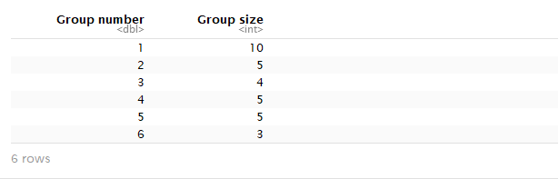

# Question 1

## Task 1a

first we will set the working directory:
```{r}
folder = 'C:\\Users\\shavit\\Desktop\\Ass3'
setwd(folder)

knitr::opts_knit$set(root.dir = folder)
```

install and use packages:
```{r}
#install.packages("igraph")
#install.packages("digest")
#install.packages("rgl")
library("igraph")
library("digest")
library("rgl")
```

Let’s load the graph:
```{r}
ga.data <- read.csv('ga_edgelist.csv', header = T)
g <- graph.data.frame(ga.data,directed = F)
```

plot the network:
```{r}
g$layout <- layout.fruchterman.reingold(g)
plot(g)
```


we can notice that there are 3 connected component.
let's take only the biggest one.

first we have to decompose the graph to 3 differnet graphs , each one is a connected component:
```{r}
dg <- decompose.graph(g)
dg
```


we have got 3 graphs, let's choose the biggest one, we have 2 ways to do that:
1) we can notice at the output, at the first detail row for each graph, the fourth element is the number of vertics in the graph.
2) calcuate it by Vcount function like here:
```{r}
maxv <- vcount(dg[[1]])
index <- 1
for (i in 2:length(dg))
{
  if(vcount(dg[[i]]) > maxv)
  {
    maxv <- vcount(dg[[i]])
    index <- i
  }
}
ga.bcg <- dg[[index]]
```

so, after we found the biggest connected component, let's calculate Betweenes, Closeness and Eigenvector.

**Betweenes**

we have to find the most betweenes actor.
```{r}
which.max(betweenness(ga.bcg))
```


as we can see Sloan has the highest betweeness. with rank of:
```{r}
max(betweenness(ga.bcg))
```
(betweeness rank of:115.3667)

**Closeness**

next, we have to check for Closeness:
```{r}
which.max(closeness(ga.bcg))
```


as we can see torres has the highest closeness. with rank of:
```{r}
max(closeness(ga.bcg))
```
(closeness rank of: 0.01754386)

**Eigenvector**

last, we have to check for Eigenvector:
```{r}
ecv <- eigen_centrality(ga.bcg)$vector
which.max(ecv)
```


as we can see kerev has the highest Eigenvector. with rank of:
```{r}
max(ecv)
```
(eigen_centrality rank of: 1)

## Task1b

we have to use 2 different algorithems to detect communities.
the first one will be: Girvan-Newman 
```{r}
gc <-  edge.betweenness.community(g)
gc
```

we can notice that the *number of the groups is 7.*
the *modularity value is ~0.58*

another way to find this details is by:
check the length, for number of groups:
```{r}
length(gc)
```
(7)

and print the modularity field in gc:
```{r}
max(gc$modularity)
```
(0.577.. ~ 0.58)

to find the size of each group:
```{r}
vectorValues = length(gc[1]$'1')
vectorIndex = 1
for (i in 2:length(gc))
{
  vectorIndex <- c(vectorIndex,i)
  vectorValues <- c(vectorValues, length(get(as.character(i),gc[i])))
}
df.groups.size <- data.frame(vectorIndex,vectorValues)
colnames(df.groups.size)[1] <- "Group number"
colnames(df.groups.size)[2] <- "Group size"
df.groups.size
```


let's detect the memberships:
```{r}
memb <- membership(gc)
memb
```


by this output we can notice which actor connected to which group.

set the nodes in color and print:
(we printed without the labels on the nodes in order to print the graph more clearly.)
```{r}
plot(g, vertex.size=5, vertex.label=NA,
     vertex.color=memb, asp=FALSE)
```


as we can see there are *7 different colors , each color for one membership group.*


the second community detection algorithem will be: fastgreedy.community
(This algorithem works only on graphs without self loops, in this case, there is not self loop.)
```{r}
gc1 <- fastgreedy.community(g)
gc1
```


we can notice that there are *6 groups* and the *modularity is ~0.59.*
to be more precise about the modularity:
```{r}
max(gc1$modularity)
```
(0.5947.. ~ 0.59)

to find the size of each group:
```{r}
vectorValues = length(gc1[1]$'1')
vectorIndex = 1
for (i in 2:length(gc1))
{
  vectorIndex <- c(vectorIndex,i)
  vectorValues <- c(vectorValues, length(get(as.character(i),gc1[i])))
}
df.groups.size <- data.frame(vectorIndex,vectorValues)
colnames(df.groups.size)[1] <- "Group number"
colnames(df.groups.size)[2] <- "Group size"
df.groups.size
```



let's detect the memberships:
```{r}
memb1 <- membership(gc1)
memb1
```


set the nodes in color and print:
(we printed without the labels on the nodes in order to print the graph more clearly.)
```{r}
plot(g, vertex.size=5, vertex.label=NA,
     vertex.color=memb1, asp=FALSE)
```


as we can see there are *6 different colors , each color for one membership group.*

**Conclude Question 1:**

a) for biggesrt component in grey antomy we found:  
  i.	  Betweenness is Sloan with 115.3667.  
  ii.	  Closeness is Torres with 0.01754386.   
  iii.	Eigenvector is Karev with 1.  
  
b) we used 2 different algorithems for communication detection:
  1) Girvan-Newman with 7 groups and modularity value of 0.5774221 (~0.58)  
  2) fastgreedy with 6 groups and modularity value of 0.5947232 (~0.59)  
  and for both of them we plot a colored graph that each color identifies a group.  


# Question 2

## a)

we will use Twitter Api:
first we will install&use the following packages:
```{r}
#install.packages("twitteR")
#install.packages("RCurl")
#install.packages("dplyr")
library(twitteR)
library(RCurl)
library(dplyr)
```


second, we will setup twitter_oauth:
```{r}
consumer_key <- "PT3nClgVetYR9srQKYEDNHhaL"
consumer_secret <- "TbQTFBgDtVBLH0w4tikdY8S4Sbvk8WH8auDUjCI7pKlKZaDeUv"
access_token <- "941464425160171520-A7Esz6wmnqWYppv2vOM4P7auk6wZXrs"
access_secret <- "ttYyhOx0iocUOUrJrGiNd8JUnUrJRsKwYwECJdV1g76u3"

setup_twitter_oauth(consumer_key,consumer_secret,access_token,access_secret)
```


we take the first 130 the tweets with the string "FCB" (Football Club Barcelona)
```{r}
tweets <- twListToDF(searchTwitter("#FCB", n=400, retryOnRateLimit=120))
```

let's take a look at the results structure:
```{r}
str(tweets)
```


we can notice about the attributes of each tweet, we will focus on tow attributes: 1)isRetweet, which describes if this is retweet tweet or not. (A Retweet is a re-posting of a Tweet.)
2)screenName, which describe the user who retweet the post. 

**our plan:** we want to analyze the relationship between the user who retweet the post and the user that this tweet was taken from him. for that we will make the following preprocess:

split tweets frame by a factor isRetweet.
```{r}
sp.tweets = split(tweets, tweets$isRetweet) 
```

save new data frame with only the retweets.
```{r}
new.tweets <- mutate(sp.tweets[['TRUE']])
```

print the text head:
```{r}
head(new.tweets$text)
```


we can notice that all the retweet messages are starting with "RT @" and after this prefix the name of the user that this retweet was taken from him, we will save these names in a new variable, named "takenFrom".
```{r}
new.tweets1 <- mutate(new.tweets, screenName = tolower(new.tweets$screenName) ,takenFrom = tolower(substr(text, 5, regexpr(':', text) - 1)))
```

next step we will create new data frame with only the relevant variables:
```{r}
writer.publisher.df <- as.data.frame(cbind(takenFrom = new.tweets1$takenFrom, screenName = new.tweets1$screenName))
head(writer.publisher.df)
```


now we will add one more variable, called weigh,  that will sum up the number of times a user retweet a tweet of a particular user
```{r}
writer.publisher.df <- count(writer.publisher.df, takenFrom, screenName) 
colnames(writer.publisher.df)[3] <- "weight"
head(writer.publisher.df)
```


## 2b,2c
now, we can create a graph and plot it:
we will use the function: graph_from_data_frame in order to create the graph, this function take the edge list from the first tow columns, and the third column considered as attributes. (the vertics are known by the edges list)
```{r}
sa_graph <- graph_from_data_frame(writer.publisher.df, directed=T)
glay = layout.fruchterman.reingold(sa_graph) 
plot(sa_graph, layout=glay)
```


this graph is hard to understand, let's make it more clear.

we will do the following steps:
1) delete self-loops
2) delete labels
3) change size of the vertics by degree 
4) change width of edges by the wight.
```{r}
sa_graph <- simplify(sa_graph, remove.loops=TRUE)
sa_graph.mod <- sa_graph
V(sa_graph.mod)$size <- degree(sa_graph.mod) * 0.4
plot(sa_graph.mod, layout=layout.fruchterman.reingold(sa_graph),edge.width=E(sa_graph.mod)$weight*0.3, edge.arrow.size=0.3,vertex.label=NA, asp=FALSE) 
```


we can see that this network is devided to number of connected components.  
there is some vertics that are alone, this vertics retweet a tweet of their own.
the biggest component shows that there is one user who many people retweet tweets from him.


we can find this user by:
```{r}
which.max(degree(sa_graph.mod))
```


that means that sport's tweets are very popular among other users and many of them retweet this user tweets.
more than that, we can see that there are some users that retweets tweets from more than one user, and for some of them there are other users that retweets from them.
we can investigate more, but this is out of the scope of this assigment so we will stop here :)

(This is the highest abstraction, from this abstraction we can distinguish groups, and general details, in order to discover a more specific details within groups we can investigate a particular group by decomposing the graph and investigate a specific membership inside it...)


## d) (do Q1 for this data)
## d1)

we have to check Betweenness, Closeness and Eigenvector for the bigest connected component in the graph:
so..
first we have to decompose the graph to differnet connected component graphs:
```{r}
sad <- decompose.graph(sa_graph)
```

now, let's choose the biggest graph (this is the biggest connected component), and work on this new graph:
```{r}
maxv <- vcount(sad[[1]])
index <- 1
for (i in 2:length(sad))
{
  if(vcount(sad[[i]]) > maxv)
  {
    maxv <- vcount(sad[[i]])
    index <- i
  }
}
```
(we did it the same way as on the top)

**Betweeness**

so.. now we have to find the most betweenes actor, we studied to find betweens only for undirected graph and therefore we convert this graph to be undirected.
```{r}
which.max(betweenness(as.undirected(sad[[index]])))
```


(betweeness rank of:115.3667)

as we can see Sport has the highest betweeness. with rank of:
```{r}
max(betweenness(as.undirected(sad[[index]])))
```
(betweeness rank of: 12371)

**Closeness**

next.. we have to check for Closeness.
```{r}
which.max(closeness(as.undirected(sad[[index]])))
```


as we can see sport has also the highest closeness. with rank of:
```{r}
max(closeness(sad[[index]]))
```
(closeness rank of: 0.0002316423)

**Eigenvector**

last.. we have to check for	Eigenvector:
```{r}
sadv <- eigen_centrality(sad[[index]])$vector
which.max(sadv)
```


as we can see sport has also the highest Eigenvector. with rank of:
```{r}
max(sadv)
```
(Eigenvector rank of: 1)

## d2)

we have to use 2 different algorithems to detect communities.
the first one will be: Girvan-Newman (in order to get modularity, we have to convert this graph to be undirected.)
```{r}
gc <-  edge.betweenness.community(as.undirected(sa_graph.mod))
gc
```


we can notice that the *number of the groups is 29.*
the *modularity value is 0.61*


to find the size of each group:
```{r}
vectorValues = length(gc[1]$'1')
vectorIndex = 1
for (i in 2:length(gc))
{
  vectorIndex <- c(vectorIndex,i)
  vectorValues <- c(vectorValues, length(get(as.character(i),gc[i])))
}
df.groups.size <- data.frame(vectorIndex,vectorValues)
colnames(df.groups.size)[1] <- "Group number"
colnames(df.groups.size)[2] <- "Group size"
df.groups.size
```


let's detect the memberships:
```{r}
memb <- membership(gc)
```

set the nodes in color and print:
(we printed without the labels on the nodes in order to print the graph more clearly.)
```{r}
plot(sa_graph.mod, vertex.size=5, vertex.label=NA,
     vertex.color=memb)
```


the second community detection algorithem will be: leading.eigenvector.community
```{r}
gc1 <- leading.eigenvector.community(as.undirected(sa_graph.mod))
gc1
```

we can notice that there are *29 groups* and the *modularity is ~0.61.*

to find the size of each group:
```{r}
vectorValues = length(gc1[1]$'1')
vectorIndex = 1
for (i in 2:length(gc1))
{
  vectorIndex <- c(vectorIndex,i)
  vectorValues <- c(vectorValues, length(get(as.character(i),gc1[i])))
}
df.groups.size <- data.frame(vectorIndex,vectorValues)
colnames(df.groups.size)[1] <- "Group number"
colnames(df.groups.size)[2] <- "Group size"
df.groups.size
```


let's detect the memberships:
```{r}
memb1 <- membership(gc1)
```


set the nodes in color and print:
(we printed without the labels on the nodes in order to print the graph more clearly.)
```{r}
plot(sa_graph.mod, vertex.size=5, vertex.label=NA,
     vertex.color=memb1)
```


**Conclude Question 2:**

a) we collected tweets that include "BFC" string by using twitter api.   
b) we created a directed graph that each vertics is user a tweet was taken from or user who retweet (publish tweet of another   user). and a arch is between them. (publisher user -> retweet user)  
c) see above (graph)  
d) for biggesrt component we found:  
   i.	  Betweenness is sport with 2278.  
   ii.	Closeness is sport  with 0.01470588 (~0.015).   
   iii.	Eigenvector is sport with 1.  
  we used 2 different algorithems for communication detection: Girvan-Newman and      
  leading.eigenvector, both of them return the same results of 29 groups  
  and modularity of 0.61.  
